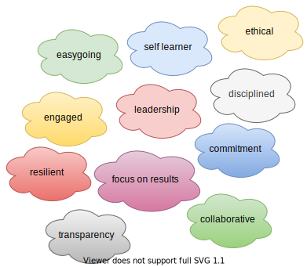

## Hi there 👋, I'm Paulo From Brazil 🧑‍✈️

 
 

<h3>Bachelor of Computer Engineering And Father 💓💓</h3>

- 🔭 I’m currently teaching/sharing things about web development, hybrid mobile development and APIs/Microservices
- 📚 I’m currently learning more about GCP (Google Cloud Platform) deep diving in Architecture using Compute Engine and Kubernetes, Apigee, Data Engineering, Anthos/Istio Service Mesh and Developing Apps using GCP.
- 💪 I’m preparing to be a Google Cloud Certified and a Scrum Master Certified (PSM)
- 👀 I'd like to have more free time to study about Puppeteer, Robot Framework and LoopBack Framework
- 📫 Fell Free To Reach Me: <a href="mailto:paulo.camargo@sw9.com.br">paulo.camargo@sw9.com.br</a>

  

- If you need help, please press the SOS Button <a href="mailto:paulo.camargo@sw9.com.br">&#127384;</a> 😉. Glad to help 👊

- I 💗 my Job

 
 
 

# More About Me &#129409;

<table>
 <tr><th> Tech Skills </th></tr>
<tr><td>

| Frameworks      | Languages     | Others         |    Architecture & DevOps   | Database |
| --------------  | ------------- | -------------   |    -------------           | ---------- |
| Strapi          | Javascript    | HTML5          |    Docker                  | SQL Server |
| Laravel         | NodeJs        | CSS            |    Kubernets               | MySQL      | 
| Zend Framework  | PHP           | Google Firebase |    Microservices           | Oracle     |
| Express         | C#			  |	Wordpress	 |    Serveless               | MongoDB |
| Restfy          | F#  		  |	Magento	       |    CI/CD                   | Firebase Datastore And Firestore |
| Adonis          | VB			  |	Git	           |    IIS                     |
| Onsen UI        | 		          |  Svn           |     Apache              |                     |
| BootStrap                |               |  TFS           |                  |                            |
| Jest And Jasmine |
| Angular |
| Electron |

|  SO             | Tools        | Cloud | IDE |
|  -------------  | -------------  | --------- | --------- |
|  Windows Server | Atlassian Stack  (Jira, Confluence, Bamboo, Bitbucket)  | GCP - Google Cloud Platform | Visual Studio |
| Linux           | Sharepoint            | Apigee API Proxy | VsCode |
|                 | Google GSuite | | Atom |
|                 | Photoshop  | | Zend Studio |
|      	         | Gimp       | |Web Storm |
|                 |	Visio     | | Eclipse |
|                 |Google Analytics | | StackBlitz |
|                 |Google Data Studio | | Cloud 9 |
							   						  
</td></tr> </table>

# 🙏 Soft Skills

# &#128220; Courses And Certificates

1. MCP Windows Server Administrator
2. SQL Server Database Administrator
3. ITIL V3
4. Project Management
5. Gitlab 
 - [GitLab 101 Trainning](https://drive.google.com/file/d/1gmOq94r9daQFq1t8BrmFuXigIn9KOhsS/view?usp=sharing)
 - [GitLab 201 Trainning](https://drive.google.com/file/d/18jFwMYHBIcZEajPt7cYP1DCUUwJb3Bl1/view?usp=sharing)
6. GCP - Google Cloud Platform

### GCP Developer Journey

1. Google Cloud Platform Fundamentals: Core Infrastructure
2. Getting Started With Application Development
3. Developing Applications with Google Cloud
4. Securing and Integrating Components of your Application

### GCP API Journey

1. API Design and Fundamentals of Google Cloud's Apigee API Platform
2. API Development on Google Cloud's Apigee API Platform
3. API Security on Google Cloud's Apigee API Platform

### GCP Architecture Journey

1. Reliable Google Cloud Infrastructure: Design and Process
2. Google Cloud Platform Fundamentals: Core Infrastructure
3. Essential Google Cloud Infrastructure: Foundation
4. Essential Google Cloud Infrastructure: Core Services
5. Elastic Google Cloud Infrastructure: Scaling and Automation

### Badges And Quests And Courses From Qwiklabs

[Google-Qwiklabs](https://googlecourses.qwiklabs.com/public_profiles/3efa5127-78f5-40fd-b04d-2d434a4d2fdb)

# Certifications

- MCP Windows Server
- [Scrum Foundation Professional (SFP)](https://www.credly.com/badges/7c424648-60f3-46b8-ba61-8b639ea59c3f/public_url)
- [DevOps Essentials Professional Certificate (DEPCP)](https://www.credly.com/badges/9cae7352-d48e-46c7-a351-b482d2cbf27c/public_url)
- [Astronomer Certification for Apache Airflow](https://www.credly.com/badges/b9b7c839-bd90-42bd-a384-aa94ba4cc606/public_url)

# Books I have already read

### 2021
- How to Train Your Mind: Exploring the Productivity Benefits of Meditation
- The Coaching Habit: Say Less, Ask More & Change the Way You Lead Forever
- Reading: Managers as Mentors: Building Partnerships for Learning (Third Edition)

## &#9889; Latest Blog Posts 

- [HTML5 Video e Audio | Reproduzindo Video e Audio de Forma Nativa](http://blog.sw9.com.br/2019/11/27/html5-video-audio-forma-nativa-serie-html5-sw9/)
- [HTML5 Data Attribute | Utilizando Atributos Customizados](http://blog.sw9.com.br/2019/11/14/html5-data-attribute-utilizando-atributos-customizados-serie-html5-sw9/)

## &#127916; Latest Youtube Playlist

- [HTML5 Journey](https://www.youtube.com/watch?v=D-XN-miEwP0&list=PLtluGZbI5ESj8XWTJcJmrVW6Q_tCi7uR8)
- [Strapi API Journey](https://www.youtube.com/watch?v=9GAl1nlNcbo&list=PLtluGZbI5ESiFrDDnKmwJNdrKZKI-hECj)
- [Google Way | Building a Form Field Similar To Google](https://www.youtube.com/watch?v=Uw-S4uCY3Zk&list=PLtluGZbI5ESjOwYr3mP_7Si0tQzRnF5P2)

## What my audience is saying ...

## Fell Free To Support Me &#9749;

